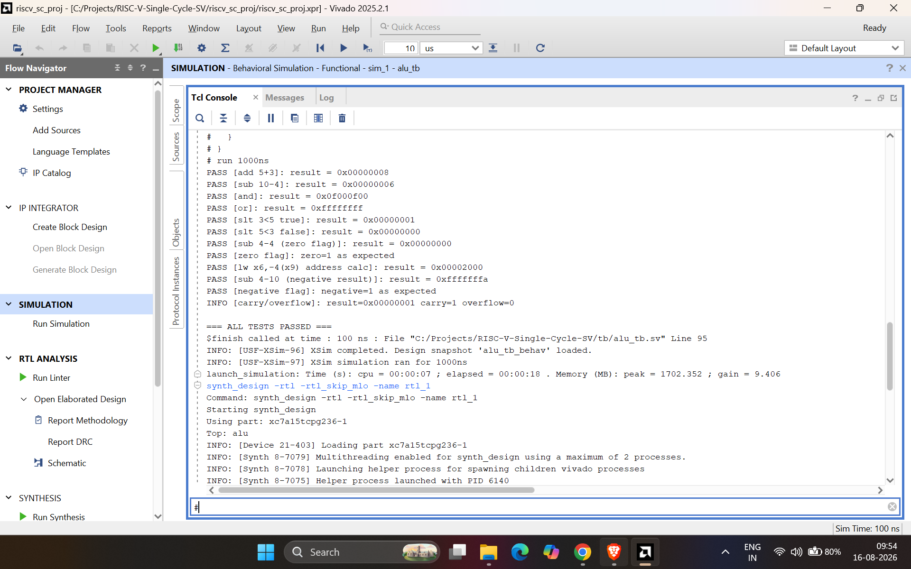
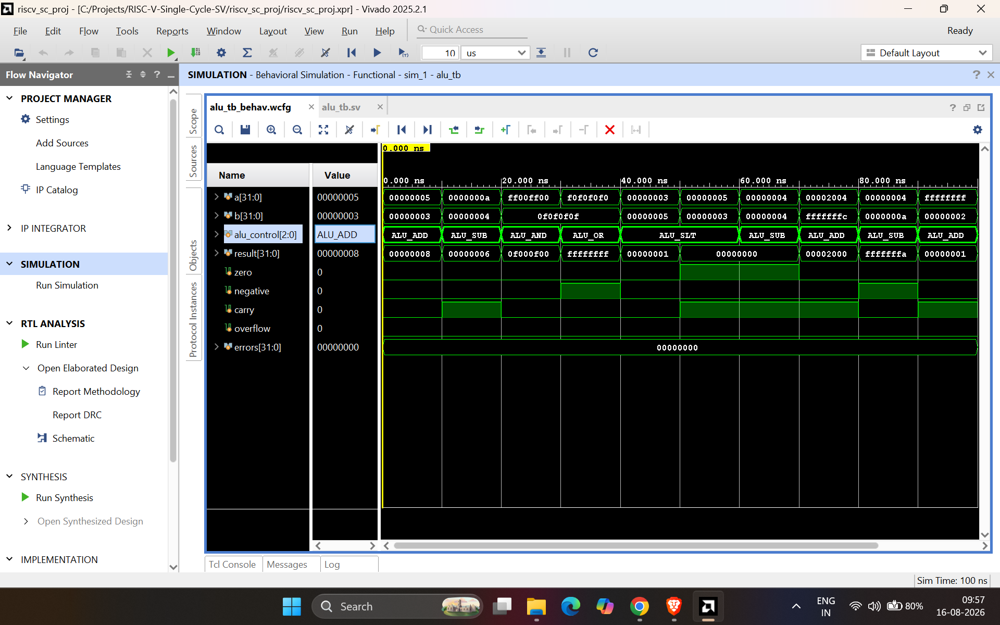
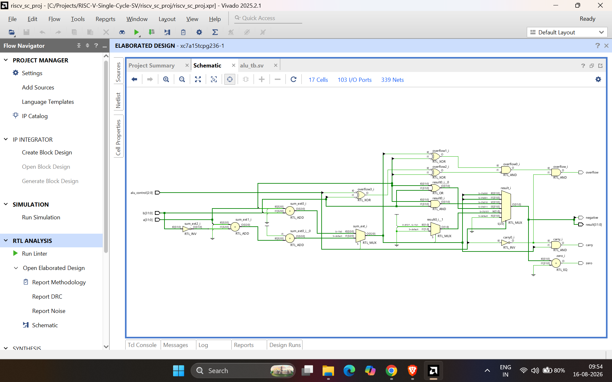

# ALU (Arithmetic Logic Unit)

The ALU is the core compute block of the single-cycle RV32I datapath. It takes two
32-bit operands and a 3-bit control code, and produces a result plus status flags.

## Interface

| Port          | Direction | Width | Description                                  |
|---------------|-----------|-------|-----------------------------------------------|
| `a`           | input     | 32    | Operand A (SrcA — typically rs1)              |
| `b`           | input     | 32    | Operand B (SrcB — rs2 or sign-extended imm)   |
| `alu_control` | input     | 3 (enum `alu_op_t`) | Selects the operation to perform |
| `result`      | output    | 32    | Result of the operation                       |
| `zero`        | output    | 1     | `1` if `result == 0` (used for `beq`)         |
| `negative`    | output    | 1     | Sign bit of `result`                          |
| `carry`       | output    | 1     | Carry-out of add/subtract                     |
| `overflow`    | output    | 1     | Signed overflow of add/subtract               |

## ALUControl encoding

| ALUControl | Operation       | Used by             |
|:----------:|-----------------|----------------------|
| `000`      | add             | `lw`, `sw`, `addi`, `add` |
| `001`      | subtract        | `beq`, `sub`          |
| `010`      | and             | `and`                 |
| `011`      | or              | `or`                  |
| `101`      | set-less-than   | `slt`                 |

Defined as a SystemVerilog enum (`alu_op_t`) in `rtl/riscv_pkg.sv`, so `alu_control`
is type-checked at compile time — it's not possible to drive the ALU with an
undefined 3-bit code.

## Design notes

- **Add/subtract share one adder.** Subtraction is done as `A + (~B) + 1`
  (two's-complement negation), avoiding a second adder.
- **`slt` reuses the subtractor.** `A < B` is true exactly when `A - B` is negative,
  so `slt` just reads the sign bit of the subtraction result and zero-extends it to
  32 bits (`1` or `0`). This same sign-bit trick is reused later for branch
  instructions (`blt`) in the pipelined design.
- **Flags (`carry`, `overflow`, `negative`) are only meaningful for add/subtract.**

## Verification

Directed testbench: `tb/alu_tb.sv`. Eleven test cases, each checking `result`
against an expected value, plus targeted checks on the `zero`, `negative`,
`carry`, and `overflow` flags.

| # | Test               | A            | B            | ALUControl | Expected Result |
|---|--------------------|--------------|--------------|------------|------------------|
| 1 | add                | `5`          | `3`          | `000`      | `8`              |
| 2 | subtract           | `10`         | `4`          | `001`      | `6`              |
| 3 | and                | `0xFF00FF00` | `0x0F0F0F0F` | `010`      | `0x0F000F00`     |
| 4 | or                 | `0xF0F0F0F0` | `0x0F0F0F0F` | `011`      | `0xFFFFFFFF`     |
| 5 | slt (true case)    | `3`          | `5`          | `101`      | `1`              |
| 6 | slt (false case)   | `5`          | `3`          | `101`      | `0`              |
| 7 | zero flag          | `4`          | `4`          | `001`      | `0`, `zero=1`    |
| 8 | address calc       | `0x2004`     | `0xFFFFFFFC` | `000`      | `0x2000`         |
| 9 | negative flag      | `4`          | `10`         | `001`      | `0xFFFFFFFA`, `negative=1` |
| 10| carry/overflow     | `0xFFFFFFFF` | `2`          | `000`      | `0x1`, `carry=1`, `overflow=0` |

All 11 checks pass in Vivado xsim (Behavioral Simulation):

```
=== ALL TESTS PASSED ===
$finish called at time : 100 ns
```

### Console output



### Waveform

Test cases stepping through in simulation, each `alu_control` value visible
alongside its inputs/outputs.



### Synthesized hardware view

Vivado's RTL schematic, generated from the SystemVerilog, confirms the design is
synthesizable, not just simulation-only. Shows the adder, the operation-select
mux, and the AND/XOR gates computing the flags.


