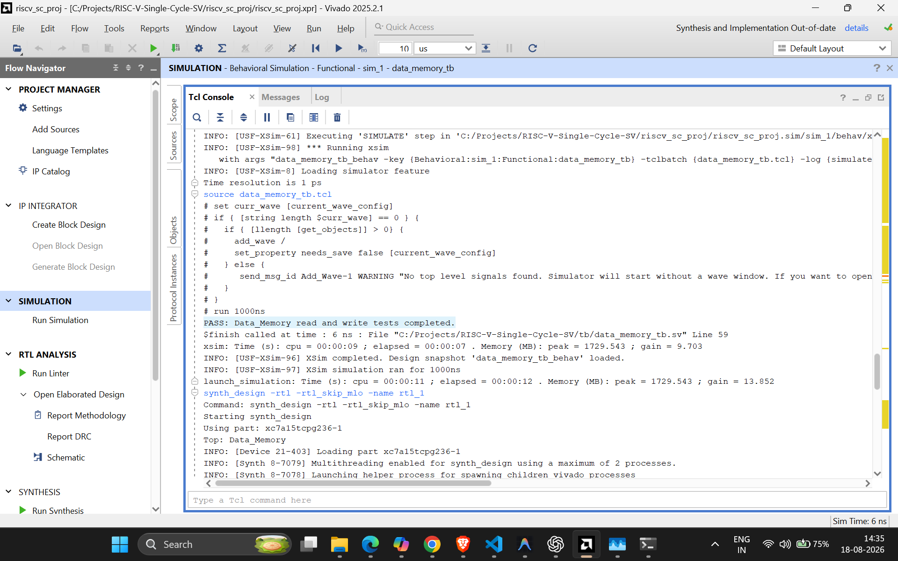
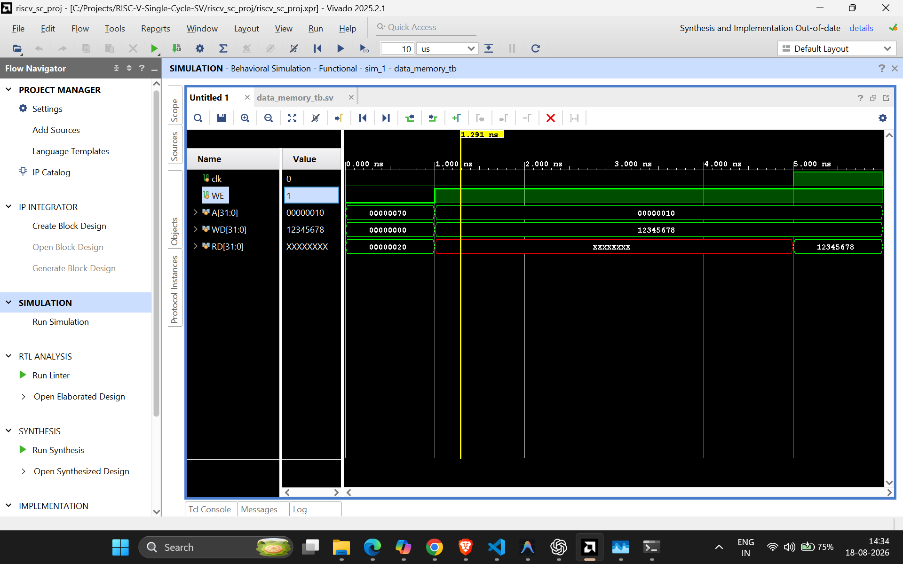
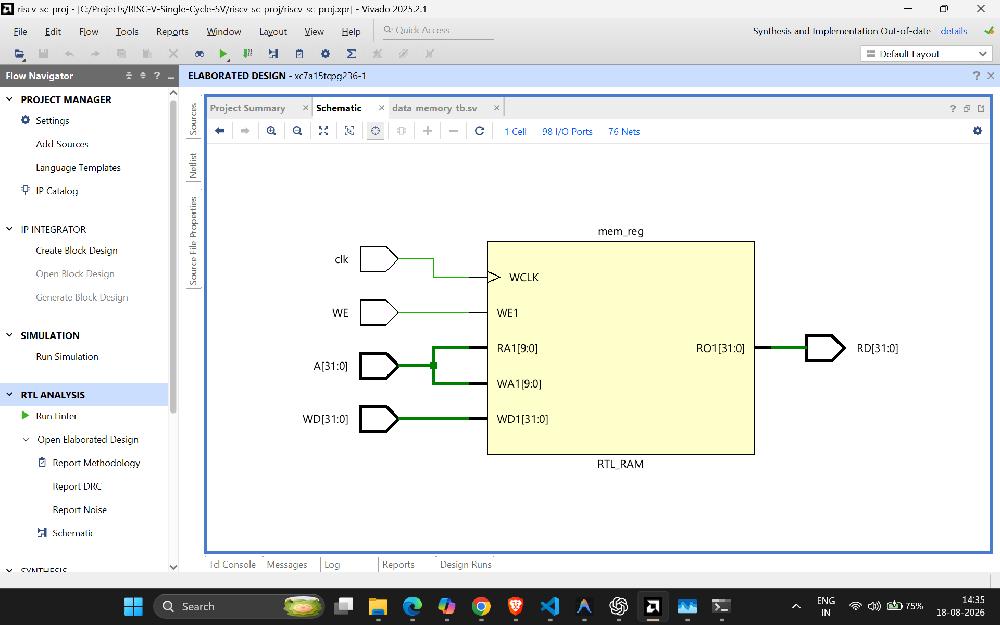

# Data Memory

The data memory provides storage for the `lw` and `sw` instructions in the
single-cycle RV32I datapath. It stores 1024 words of 32 bits, giving a total
capacity of 4 KiB.

## Interface

| Port | Direction | Width | Description |
|------|-----------|-------|-------------|
| `clk` | input | 1 | Processor clock; stores occur on its rising edge |
| `WE` | input | 1 | Write enable: `1` for a store, `0` for read only |
| `A` | input | 32 | Byte address computed by the ALU |
| `WD` | input | 32 | Write data, normally the `rs2` register value |
| `RD` | output | 32 | Read data returned to the register-file write-back mux |

## Addressing

The memory is declared as 1024 words:

```systemverilog
logic [31:0] mem [0:1023];
```

Each word occupies four bytes. `A` is a byte address, so `A[1:0]` identifies a
byte within the selected word and is ignored for aligned 32-bit accesses.
`A[11:2]` supplies the 10-bit word index required for 1024 locations.

| Byte address `A` | Word index | Accessed location |
|------------------|------------|-------------------|
| `0` | `0` | `mem[0]` |
| `4` | `1` | `mem[1]` |
| `16` | `4` | `mem[4]` |
| `112` | `28` | `mem[28]` |

## Design notes

- **Stores are synchronous.** When `WE` is high, `WD` is stored at the rising
  edge of `clk`. This implements the behavior required by `sw`.
- **Loads are asynchronous.** `RD` always reflects `mem[A[11:2]]`, allowing
  load data to flow to the write-back stage in the same clock cycle.
- **Only aligned 32-bit accesses are supported.** Byte and half-word loads or
  stores (`lb`, `lh`, `sb`, `sh`) are not implemented in this module.
- **Simulation initialization.** `mem[28]` starts as `32'h0000_0020`, so a
  word load from byte address 112 returns decimal 32. This supports a simple
  `lw` verification case.

## Verification

Directed testbench: `tb/data_memory_tb.sv`.

| # | Test | Operation | Expected result |
|---|------|-----------|-----------------|
| 1 | Initial load | Read byte address `112` | `RD = 32'h0000_0020` |
| 2 | Store | Write `32'h1234_5678` at byte address `16` with `WE = 1` | `mem[4]` is updated on the rising edge |
| 3 | Load after store | Read byte address `16` with `WE = 0` | `RD = 32'h1234_5678` |

A successful Vivado behavioral simulation prints:

```
PASS: Data_Memory read and write tests completed.
```

### Console output

The Vivado simulator console confirms that the initial load and the clocked
store/load checks completed successfully.



### Waveform

At the start of the simulation, address `112` reads the initialized value
`32'h0000_0020`. The testbench then selects address `16`, writes
`32'h1234_5678` on a rising edge, and reads the same value back.



### Synthesized hardware view

Vivado's RTL schematic confirms that the data-memory module is synthesizable.
It shows the memory array, clocked write path, address input, write-enable
control, and read-data output.


