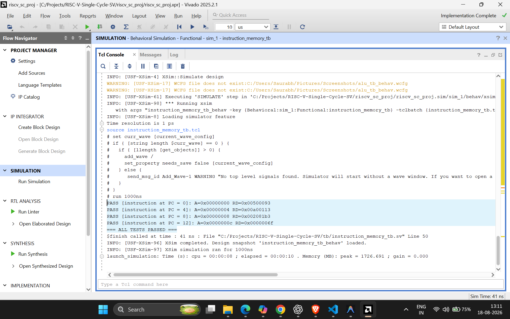
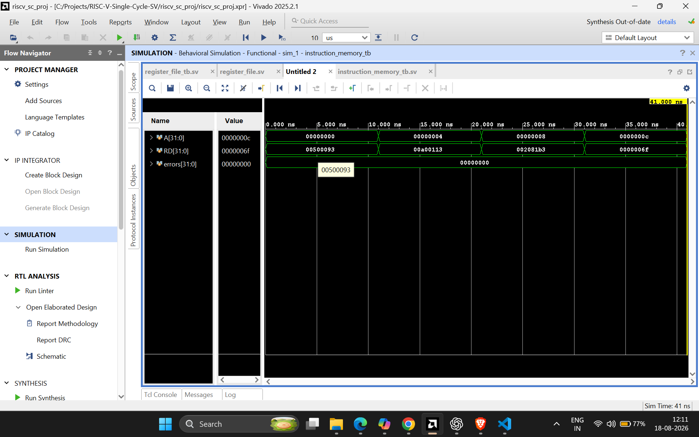
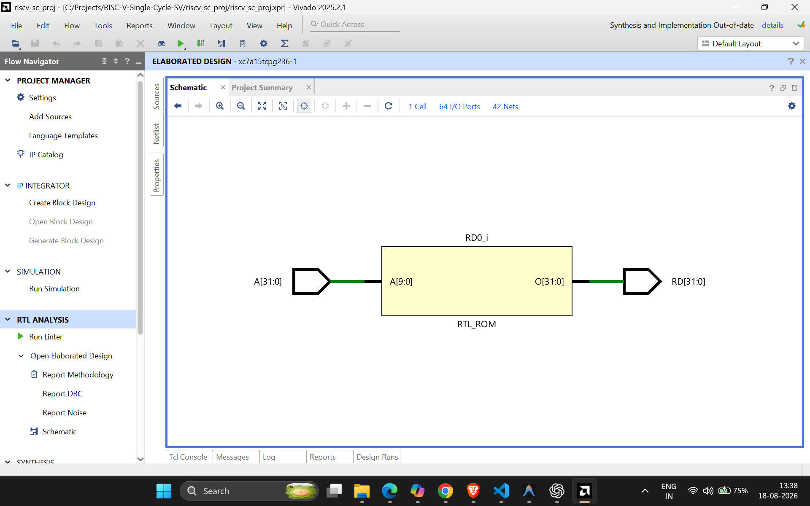

# Instruction Memory

1024 x 32-bit read-only instruction memory for the single-cycle RV32I
datapath. It loads a RISC-V program from `memfile.mem` and returns the
instruction selected by the current PC byte address.

## Interface

| Port | Direction | Width | Description |
|------|-----------|-------|-------------|
| `A`  | input     | 32    | Byte address from the Program Counter (PC) |
| `RD` | output    | 32    | 32-bit instruction read from memory |

## Design notes

- **Instruction memory is read-only.** The processor fetches instructions
  from this memory; it does not write them during normal execution.
- **No reset logic.** Reset belongs to the PC. On reset, the PC will become
  `0`, so instruction memory naturally returns the first instruction,
  `mem[0]`.
- **Byte address to word address.** Each RV32 instruction is 32 bits, or
  4 bytes. `A[1:0]` is therefore always `2'b00` for an aligned instruction
  address and is not needed to select an instruction. `A[31:2]` divides the
  byte address by four:

  | PC address `A` | Memory location | Instruction |
  |----------------|-----------------|-------------|
  | `0x00000000` | `mem[0]` | first instruction |
  | `0x00000004` | `mem[1]` | second instruction |
  | `0x00000008` | `mem[2]` | third instruction |
  | `0x0000000C` | `mem[3]` | fourth instruction |

- **Program initialization file.** `$readmemh("memfile.mem", mem)` loads
  one 32-bit hexadecimal instruction per line. `memfile.mem` is added as a
  Vivado simulation memory file. For the final CPU, replace its small test
  program with the desired RISC-V program; the instruction-memory RTL stays
  unchanged.
- **Memory size.** `mem[0:1023]` stores 1024 instructions. At 4 bytes per
  instruction, this is 4 KB of instruction memory. The current program must
  use addresses from `0x00000000` through `0x00000FFC`.
- **Future pipeline use.** This is the instruction-memory block in the IF
  (Instruction Fetch) stage. Later, `RD` will be captured in the `IF/ID`
  pipeline register together with `PC` and `PC + 4`.

## Verification

Directed testbench: `tb/instruction_memory_tb.sv`. The testbench changes the
input address and verifies that `RD` matches the instruction loaded from
`tb/memfile.mem`.

| # | Test | Address `A` | Expected `RD` |
|---|------|-------------|---------------|
| 1 | First instruction fetch | `0x00000000` | `0x00500093` |
| 2 | Second instruction fetch | `0x00000004` | `0x00A00113` |
| 3 | Third instruction fetch | `0x00000008` | `0x002081B3` |
| 4 | Fourth instruction fetch | `0x0000000C` | `0x0000006F` |

All 4 checks pass in Vivado xsim (Behavioral Simulation):

```
=== ALL TESTS PASSED ===
```

### Console output

Save the Vivado console screenshot as
`docs/images/instruction_memory/console_pass.png`.



### Waveform

The waveform shows `A` changing by 4 bytes each test and `RD` returning the
corresponding instruction. `errors` remains `0` throughout the simulation.



### Synthesized hardware view

Save the Vivado elaborated-design schematic as
`docs/images/instruction_memory/schematic.png`. It should show the memory
array and the combinational read path from `A` to `RD`.


