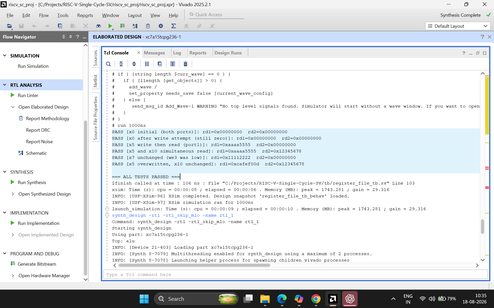
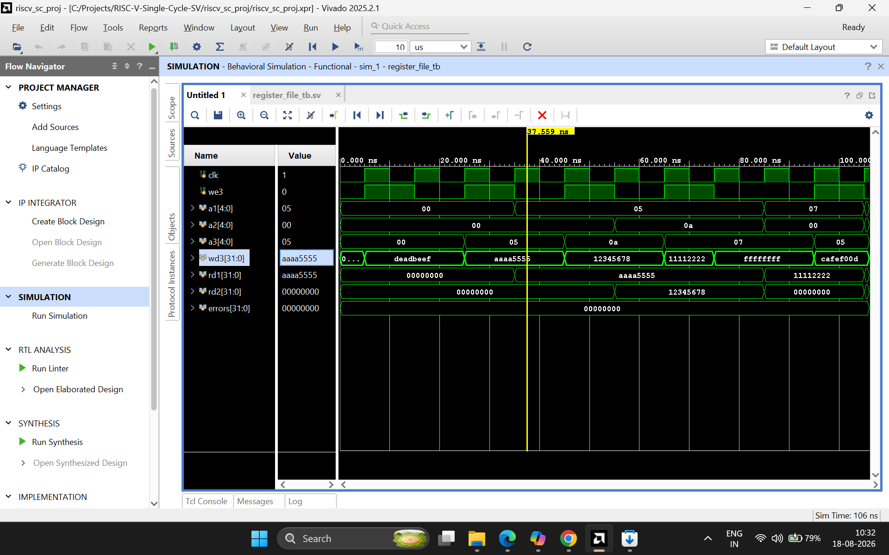
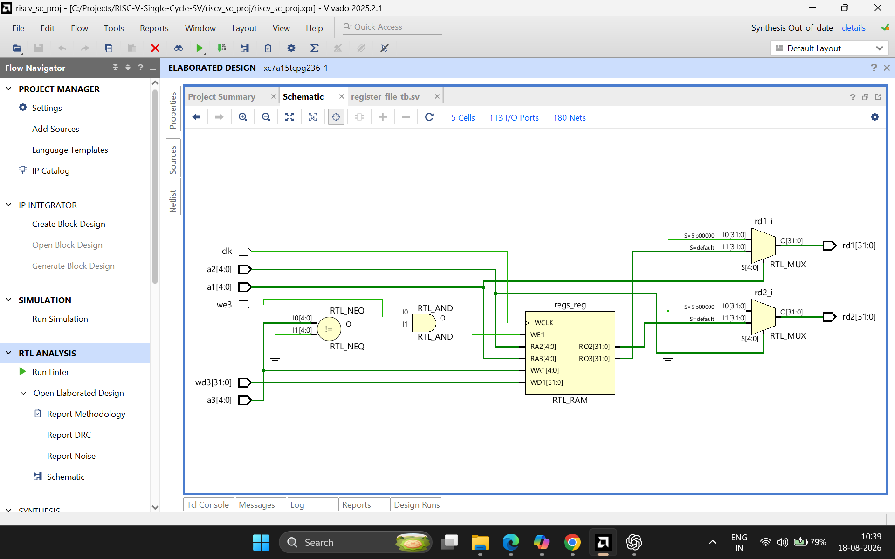

# Register File

32 x 32-bit register file for the single-cycle RV32I datapath: two combinational
read ports, one clocked write port, `x0` hardwired to zero.

## Interface

| Port  | Direction | Width | Description                                  |
|-------|-----------|-------|-----------------------------------------------|
| `clk` | input     | 1     | Clock — write port only; reads are combinational |
| `we3` | input     | 1     | Write enable (from Control Unit's RegWrite)   |
| `a1`  | input     | 5     | Read address 1 (rs1)                          |
| `a2`  | input     | 5     | Read address 2 (rs2)                          |
| `a3`  | input     | 5     | Write address (rd)                            |
| `wd3` | input     | 32    | Write data                                    |
| `rd1` | output    | 32    | Read data 1                                   |
| `rd2` | output    | 32    | Read data 2                                   |

## Design notes

- **Two read ports, one write port.** Most RV32I instructions read two source
  registers (`rs1`, `rs2`) simultaneously but write only one destination
  (`rd`) per instruction, so the port count matches actual usage.
- **Reads are combinational, writes are clocked.** `rd1`/`rd2` update
  instantly when `a1`/`a2` change (plain `assign`); writes only commit on a
  rising clock edge (`always_ff`), matching how real register files behave.
- **`x0` is hardwired to zero on both sides.** The write path ignores any
  write to address `0` (`a3 != 0` check before writing), and the read path
  additionally forces address `0` to return `0` regardless of stored content.
  This double enforcement guarantees `x0` always reads `0` per the RISC-V
  spec, independent of any reset state.
- **No reset logic.** Only `x0`'s value is architecturally guaranteed; every
  other register holds undefined content until explicitly written, matching
  real hardware behavior (SRAM/flip-flops have no defined power-on state
  without added reset logic). The PC and pipeline control logic are where
  reset actually matters, not the register file.

## Verification

Directed testbench: `tb/register_file_tb.sv`. Six test cases, each checking
both read ports after a sequence of writes.

| # | Test                          | Action                                   | Expected                          |
|---|-------------------------------|-------------------------------------------|------------------------------------|
| 1 | x0 initial read               | Read x0 before any writes                 | `rd1=0`, `rd2=0`                   |
| 2 | x0 write-immune               | Write `0xDEADBEEF` to x0, then read       | Still `0` — write silently ignored |
| 3 | Basic write/read              | Write `0xAAAA5555` to x5, read on port 1  | `rd1=0xAAAA5555`                   |
| 4 | Simultaneous dual read        | Write x10, read x5 and x10 at once        | `rd1`/`rd2` correct independently  |
| 5 | Write-disable respected       | Write x7, then attempt write with `we3=0` | Original value unchanged           |
| 6 | Overwrite                     | Write new value to x5, re-read x5 and x10 | x5 updated, x10 untouched          |

All 6 checks pass in Vivado xsim (Behavioral Simulation):

```
=== ALL TESTS PASSED ===
```

### Console output



### Waveform

Each write followed by a read-back, showing the register file's state
updating only on clock edges while reads track combinationally.



### Synthesized hardware view

Vivado's RTL schematic — shows the 32-entry storage array, the write-address
decode logic, and the read-side muxes/comparators enforcing the x0 = 0 rule.


